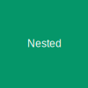

# Nested Post

This content is located at `content/posts/nested-post/index.mdx`.

## Assets

This structure allows you to keep images and other assets co-located with the markdown file.

> Note: Assets are served directly from the content directory via a dynamic route handler.

