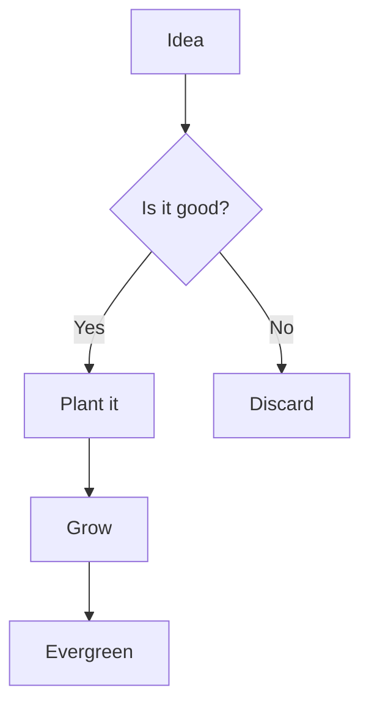

Visualizing information is key to understanding. Amytis integrates Mermaid.js for diagrams and handles images with ease.

## Mermaid Diagrams

You can write diagrams directly in your markdown:

## Images

Standard markdown images are supported, including relative paths:

